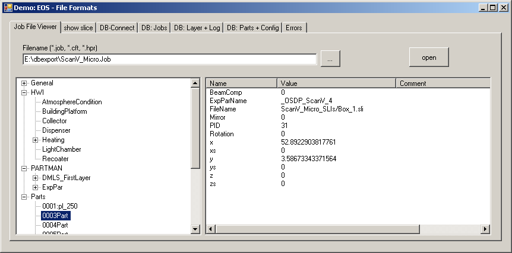
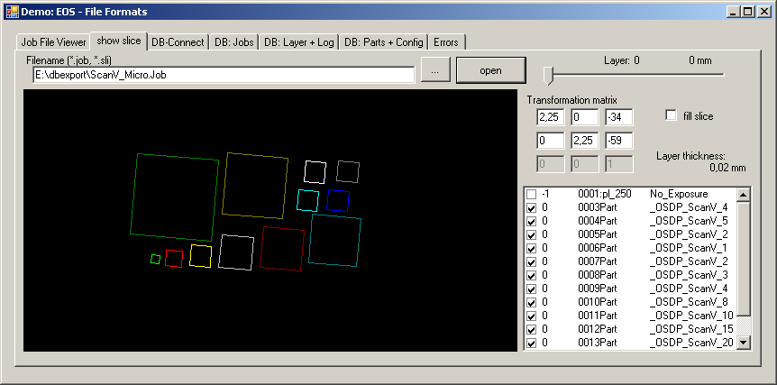
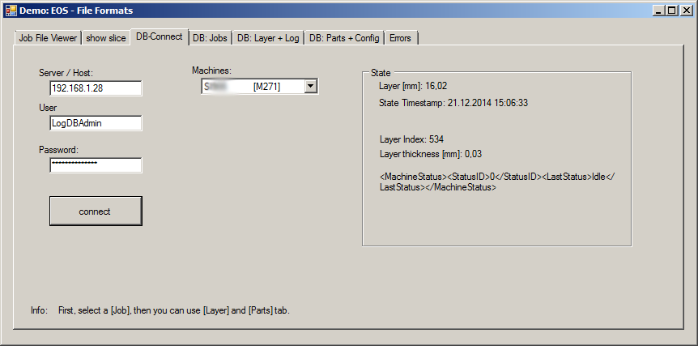
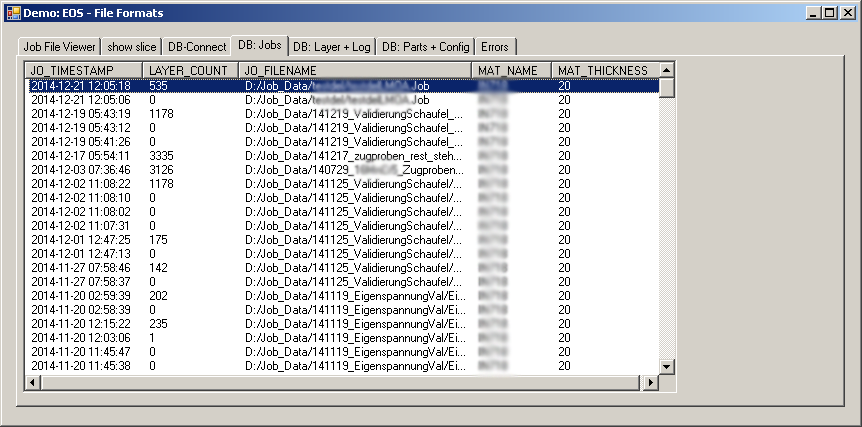

EOS-Formats
===========

job-format
----------
* read .job files of the Process-controlling-Software (create with PSW Software) of 3D Printers from EOS GmbH(c) 
* C++ Library (visual Studio 2015)
* or use as commad line tool to convert eos .job files to .xml. 

sli-format
----------
* read .sli "Slice Layer Interface" (Proprietary form of the "Common Layer Interface" format)
* [Magic number](https://en.wikipedia.org/wiki/File_format#Magic_number) of the File format: : `EOS 1993 SLI FILE` 
* C++ Library (visual Studio 2015)

Demo
----
* Demonstration application for job-format-library to view .job files in a treeview
* open and view/render EOS-sli files
* Query EOS-DB to get information about current build process and finished jobs
* C# (visual Studio 2013) 
<code> /examples/Demo.exe</code>

c#-sli-library (additional stuff)
----
in the directory `c#-sli-library` you can find a c# library to access the .sli and .cli format with the following drawbacks:
* no visual studio project
* you need to replace the error handling
* code comments in German
> to any body: feel free to clean up this and send a pull request :-) - I do not have time for this at the moment!

Status
------
2014-12-11

---
EOS is a registered trademark of EOS GmbH and not involved in this project
