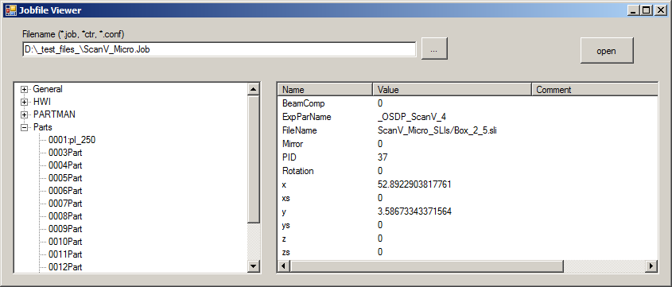

EOS-Formates
============

job-format
----------
* read .job files for Process-controlling-Software of EOS GmbH(c) of 3D Printers
* C++ Library (visual Studio 2013)
* or use as commad line tool to convert eos .job files to .xml.
   /job-format/Debug/job-format.exe "myjob.job"

Demo
----
* Demonstration application for viewing .job files in a treeview
* C# (visual Studio 2013)

Status
------
2014-11-21

---
EOS is a registered trademark of EOS GmbH