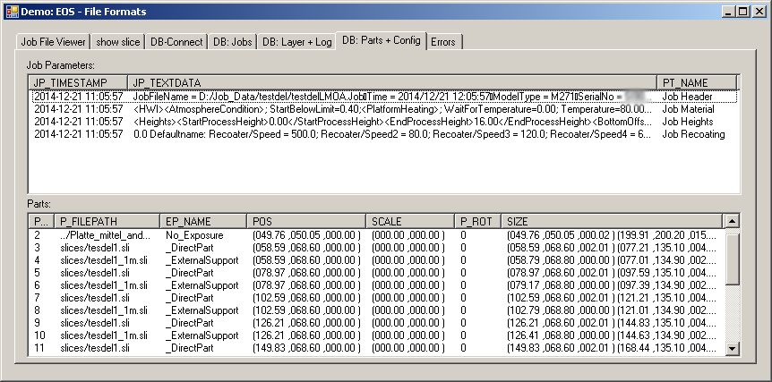

EOS-Formats
===========

job-format
----------
* read .job files of the Process-controlling-Software of 3D Printers from EOS GmbH(c) 
* C++ Library (visual Studio 2013)
* or use as commad line tool to convert eos .job files to .xml. 

sli-format
----------
* read .sli "Slice Layer Interface" (Proprietary form of the "Common Layer Interface" format)
* C++ Library (visual Studio 2013)

Demo
----
* Demonstration application for job-format-library to view .job files in a treeview
* open and view/render EOS-sli files
* Query EOS-DB to get information about current build process and finished jobs
* C# (visual Studio 2013) 
<code> /Demo/Release/Demo.exe</code>

Status
------
2014-12-11

---
EOS is a registered trademark of EOS GmbH and not involved in this project
